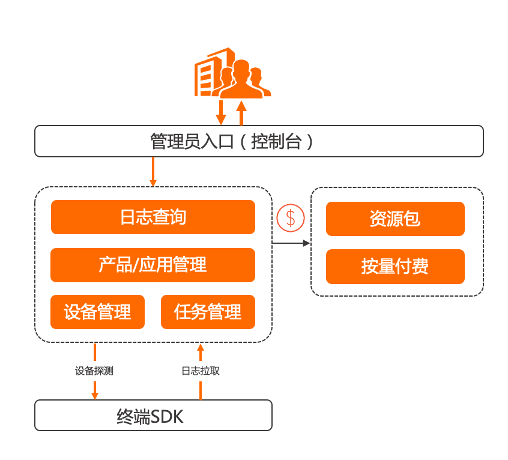

# emas_tlog

```ali emas tlog```

阿里巴巴```flutter``` 版本 远程日志 ```TLog```

## 介绍

远程日志服务提供远程手机日志拉取功能，解决移动```App```线上异常排查困难的问题。
远程日志服务支持```Android/iOS```应用类型。

## 产品架构



1.移动```App```集成```SDK```。
2.远程日志服务通过心跳探测识别已安装```App```的移动终端，并进行日志拉取配置。
3.远程日志服务拉取指定移动终端```App```的用户日志，并对拉取任务进行管理。
4.远程日志服务查看已从终端设备拉取至控制台的用户日志。

官网地址：[官网地址](https://help.aliyun.com/document_detail/164992.html)

本项目是根据官方来制作的```flutter```版本

## 快速开始

#####```flutter```配置：

```
  emas_tlog: ^0.0.2
```

初始化：

```
方法的声明：
static void init(String appKey,String appSecret,String rsaPublicKey,
      String appKeyIos,String appSecretIos,String rsaPublicKeyIos,
      {String androidChannel = "line",String userNick = "NoLogin",ApmLogType? type,bool debug = true}){
// xxxxxx
}
方法的调用：
EmasTlog.init("**", "**", "**",
        "**","**","**",
        androidChannel :"HEHE",userNick: "lalala2");
```

参数说明：
```appKey```
```appSecret```
```rsaPublicKey```
```appKeyIos```：```iOS```的```emas.appKey```
```appSecretIos```：```iOS```的```emas.appSecret```
```rsaPublicKeyIos```：```iOS```的```appmonitor.tlog.rsaSecret```
```androidChannel```:   渠道 （```iOS``` 指定 ```App Store```）
```userNick```:  用户昵称说明:  默认值```NoLogin```
```type``` （*日志上传类型，```注：iOS若不传，默认是I```）
```debug``` （底层运行日志答应）```true``` 测试环境开启 ```false``` 正式环境 关闭(```iOS```可不传)

*星号标记说明

```V：```可拉取所有级别的日志。(```iOS```无此类型)

```D：```可拉取```DEBUG/INFO/WARN/ERROR```级别的日志。

```I：```可拉取```INFO/WARN/ERROR```级别的日志。

```W：```可拉取```WARN/ERROR```级别的日志。

```E：```可拉取```ERROR```级别的日志。

日常使用：

```
方法的声明：
static void init(String appKey,String appSecret,String rsaPublicKey,
      String appKeyIos,String appSecretIos,String rsaPublicKeyIos,
      {String androidChannel = "line",String userNick = "NoLogin",ApmLogType? type,bool debug = true}){
// xxxxx
}

方法的调用：
EmasTlog.log(ApmLogType.I, "tag2_1231231",module: "hehe2_flutter",tag: "tag_hehe2");
EmasTlog.log(ApmLogType.V, "tag2_1231231",module: "hehe2_flutter",tag: "tag_hehe2");
EmasTlog.log(ApmLogType.W, "tag2_1231231",module: "hehe2_flutter",tag: "tag_hehe2");
EmasTlog.log(ApmLogType.E, "tag2_1231231",module: "hehe2_flutter",tag: "tag_hehe2");
EmasTlog.log(ApmLogType.D, "tag2_1231231",module: "hehe2_flutter",tag: "tag_hehe2");
EmasTlog.log(ApmLogType.I, "tag2_1231231",module: "hehe2_flutter",tag: "tag_hehe2");
```

说明：
```module``` 为模块业务，可以为空

```
    EmasTlog.comment(); 主动上传日志
    EmasTlog.updateNickName(name) 修改用户名（用于登录切换用户）
```

#####```Android``` 配置：
1、在根项目```Android```目录```build.gradle```配置如下代码

```

ext {
    tlog = [
            openUtdid     : true
    ]
}

```

说明：
如果项目编译期报类似如下错误

```

Duplicate class com.ta.utdid2.a.a.a found in modules jetified-alicloud-android-utdid-2.5.1-proguard (com.aliyun.ams:alicloud-android-utdid:2.5.1-proguard) and jetified-utdid-1.5.2.1 (com.umeng.umsdk:utdid:1.5.2.1)

```

则代码需要调整为

```

ext {
    tlog = [
            openUtdid     : false
    ]
}

```

配置展示：

```

ext {
    tlog = [
            openUtdid     : true
    ]
}

buildscript {
    ext.kotlin_version = '1.3.50'
    repositories {
        google()
        jcenter()
    }

    dependencies {
        classpath 'com.android.tools.build:gradle:4.1.0'
        classpath "org.jetbrains.kotlin:kotlin-gradle-plugin:$kotlin_version"
    }
}

allprojects {
    repositories {
        google()
        jcenter()
    }
}

```

根```app AndroidManifest``` 配置：

```

<manifest **
    xmlns:tools="http://schemas.android.com/tools"
    ** >

   <application
   **
       tools:replace="android:label">

```

说明需要 配置 ```tools:replace="android:label"```

#####iOS 的配置说明
1、在```Flutter```项目的```iOS```端的```Podfile```中添加如下索引库地址：
```
# alicloud
source "https://github.com/CocoaPods/Specs.git"
source "https://github.com/aliyun/aliyun-specs.git"
```
2、在```Flutter```项目的```iOS```端的```info.plist```文件中添加如下代码：
```
<key>NSAppTransportSecurity</key>
	<dict>
		<key>NSAllowsArbitraryLoads</key>
		<true/>
	</dict>
<key>NSBonjourServices</key>
	<array>
		<string>_dartobservatory._tcp</string>
	</array>
<key>NSLocalNetworkUsageDescription</key>
<string>Main</string>
```
3、在```iOS```端项目```Build Setting```中，将```Allow Non-modular Includes In Framework Modules```设置为```YES```
#####iOS报错情况解决：
```问题1：```
```
Flutter: target has transitive dependencies that include statically linked binariesxxxx
```
```解决问题1：```
```
target 'Runner' do
#   use_frameworks!
  use_modular_headers!

  flutter_install_all_ios_pods File.dirname(File.realpath(__FILE__))
end
```
```注释掉use_frameworks! ```
如果存在其他含swift文件的插件的情况，这会造成新问题(Swift与OC汇编找不到文件)
故，以上解决办法不可取，需要保留```use_frameworks!```加入下面的代码即可：
```
pre_install do |installer|
  # workaround for https://github.com/CocoaPods/CocoaPods/issues/3289 静态库
  Pod::Installer::Xcode::TargetValidator.send(:define_method, :verify_no_static_framework_transitive_dependencies) {}
end
```